# CNNs

## Assets

- Lecture
  - https://fullstackdeeplearning.com/spring2021/lecture-2a/
- PDF
  - [Downloaded](assets/fsdl-berkeley-lecture2-convnets.pdf)

---

# 1. Review of the convolution operation

## What's a convolutional filter ?

### FC (Fully-Connected Layers)

- 어떤 layer의 모든 항목(뉴런)이 다음 layer의 모든 항목(뉴런)과 연결된 상태

  - `Fully connected input layer (평탄화)`
    - 이전 layer의 출력을 `평탄화`하여 다음 layer의 입력이 될 수 있는 단일 벡터로 변환
    - 2차원 배열 형태의 이미지를 1차원 배열로 평탄화

  - Fully connected ouput layer
    - Convolution/Pooling 프로세스의 결과를 정의된 라벨(카테고리)로 분류
    - Active Functions(ReLU, Sigmoid, tanh 등) 항목(뉴런)을 활성화
    - 분류기(softmax) 함수로 분류

- 문제점

  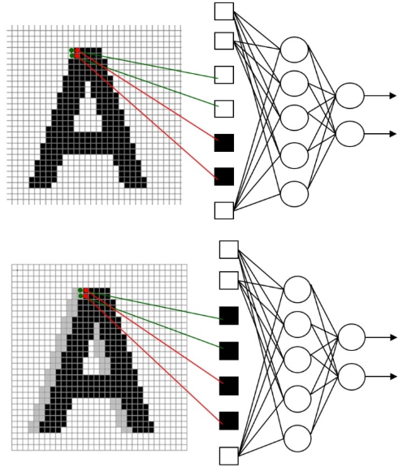

### Convolutional filters

- Convolution

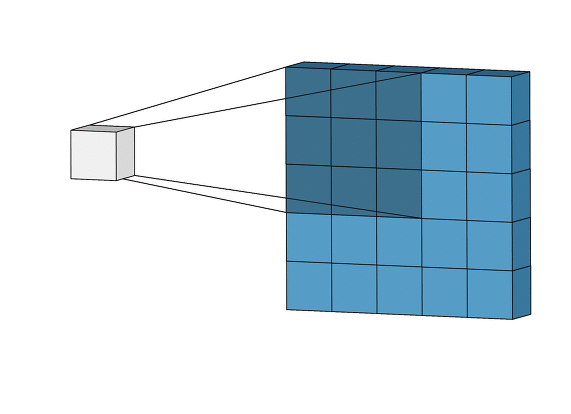

- filter

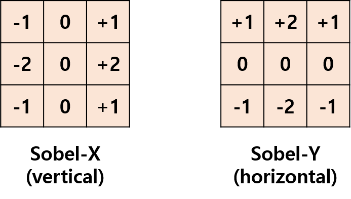

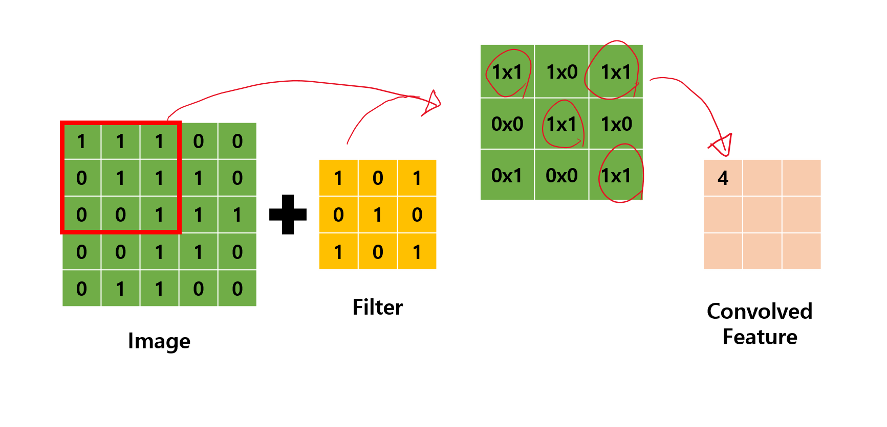

## Filter stacks and ConvNets

- ConvNet
  - sequence of Convolutional Layers, interspersed with activation functions

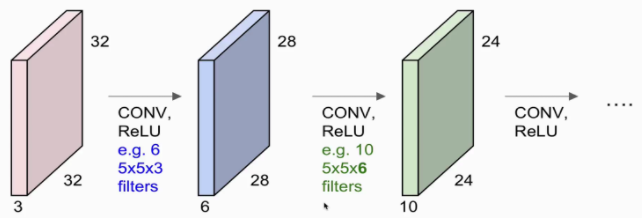

- Activation Functions

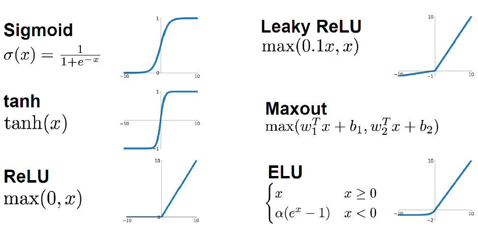

## Strides & padding

- Stride
  - Convolutions can subsample the image by jumping across some locations

- Padding
  - solves the problem of filters running out of image

## Filter math

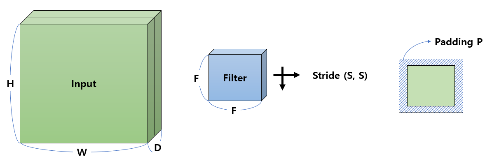

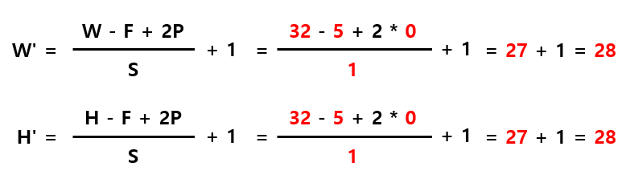

- A guide to convolution arithmetic for deep learning
  - https://github.com/vdumoulin/conv_arithmetic

- (Q) filter의 크기는 정사각형?
  - 그런 경향이 있음
- (Q) Why padding?
  - Stride와 관련하여 경계를 넘지 않고 진행할 수 있도록 해주기 위해

## Implementation notes

- CS231n: Convolutional Neural Networks for Visual Recognition
  - https://cs231n.github.io/convolutional-networks/

---

# 2. Other important operations for ConvNets

## Increasing the receptive field (dilated convolutions)

- receptive field(수용영역)
  - 외부 자극이 전체에 영향을 미치는 것이 아니라 특정 영역에만 영향을 미침
  - 거리가 멀어질수록 그 영향은 감소
- 하나의 큰 필터를 사용하는 것보다, 작은 필터를 중첩하는 것이 더 효과적

## Decreasing the size of the tensor

### Pooling

- max pooling
  - 2x2 max pooling is most common
- average pooling

### 1x1 - convolutions

- reduce the 'depth' dimension

---

# 3. Classic ConvNet architectures

## LeNet-5

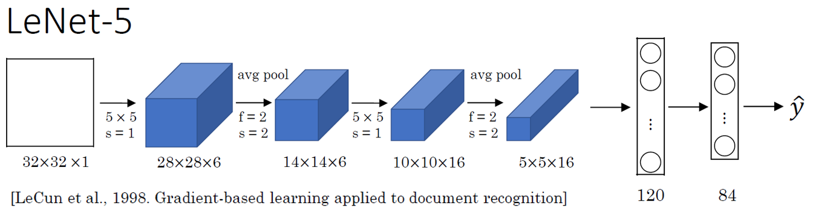

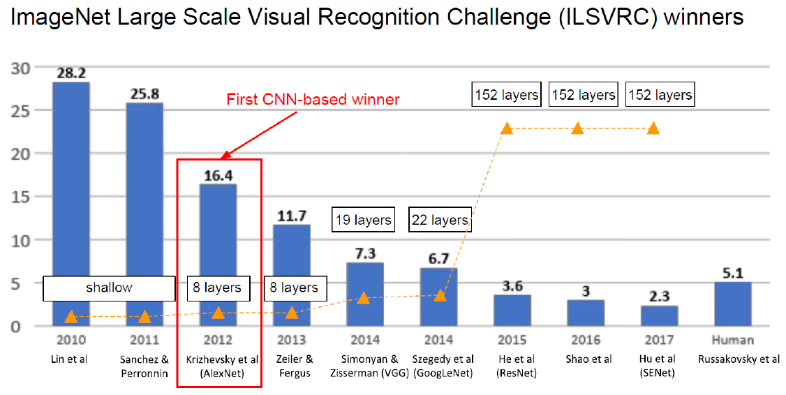

---
---

# Computer Vision Applications

- Lecture
  - https://fullstackdeeplearning.com/spring2021/lecture-2b/
- PDF
  - [Downloaded](assets/fsdl-berkeley-lecture2-vision-applications.pdf)

---
---

# Lab 2: CNNs and Synthetic Data

- Lecture
  - https://fullstackdeeplearning.com/spring2021/lab-2/
- GitHub
  - https://github.com/full-stack-deep-learning/fsdl-text-recognizer-2021-labs/tree/main/lab2

---

## 실습 환경

- colab 환경 설정
  - https://github.com/full-stack-deep-learning/fsdl-text-recognizer-2021-labs/blob/main/setup/readme.md

- GPU 환경셋팅 먼저 하고 시작
  - Runtime > Change Runtime type > GPU

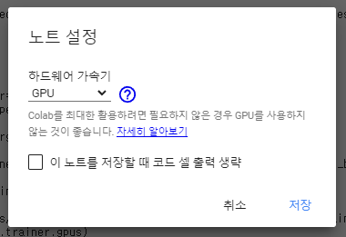

## EMNIST & MNIST

### MNIST
- The MNIST database of handwritten `digits`, available from this page, has a training set of 60,000 examples, and a test set of 10,000 examples. It is a subset of a larger set available from NIST. The digits have been size-normalized and centered in a fixed-size image.
- http://yann.lecun.com/exdb/mnist/

### EMNIST
- The EMNIST dataset is a set of handwritten `character digits` derived from the NIST Special Database 19  and converted to a 28x28 pixel image format and dataset structure that directly matches the MNIST dataset.
- Further information on the dataset contents and conversion process can be found in the paper available at https://arxiv.org/abs/1702.05373v1
- https://www.nist.gov/itl/products-and-services/emnist-dataset

## 실습

- Colab
  - [FDSL_CNNs.ipynb](assets/FDSL_CNNs.ipynb)

- EMNIST
  - https://github.com/full-stack-deep-learning/fsdl-text-recognizer-2021-labs/blob/main/lab2/notebooks/01-look-at-emnist.ipynb
  - https://github.com/full-stack-deep-learning/fsdl-text-recognizer-2021-labs/blob/main/lab2/notebooks/02-look-at-emnist-lines.ipynb